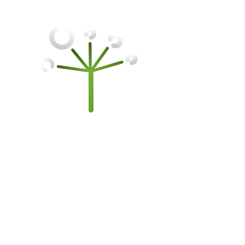

# <div style="display: flex; justify-content: center;"><span style="font-size: 60px; padding-bottom: 5px; margin-top: 60px;">Valerian.js</span></div>
<div style="display: flex">
<div>
<p>Fast, readable, flexible web development.</p>
<p>Custom markdown incorporating the powers of a web framework.</p>
<b>Zero dependencies.</b> 
</div>

<div style="flex-grow: 1;" >

</div>
</div>

## hello.vlr
```php
html:
    head:
        title: "My Valerian.js Website"
    body:
        (Header
            h1: "Welcome!"
        )
        (Content
            p: "😊"
        )
```

## hello.html
```html
<html>
	<head>
		<title>
			My Valerian.js Website
		</title>
	</head>
	<body>
		<div id="Header">
			<h1>
				Welcome!
			</h1>
		</div>
		<div id="Content">
			<p>
				😊
			</p>
		</div>
	</body>
</html>
```